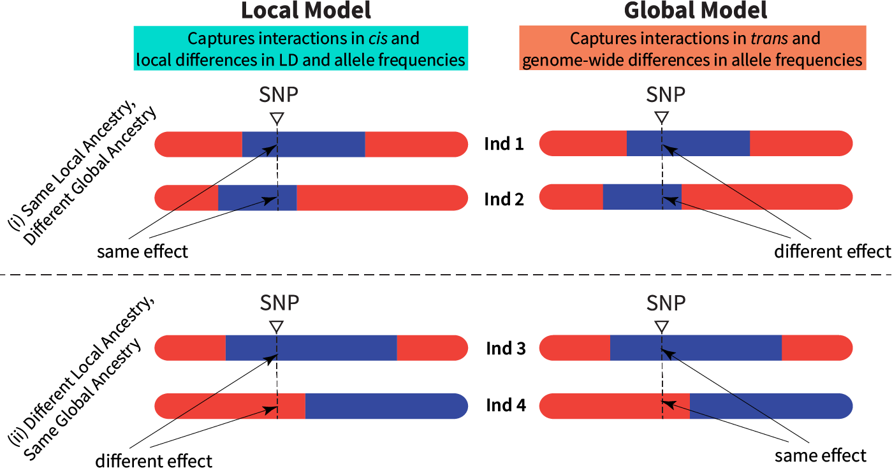
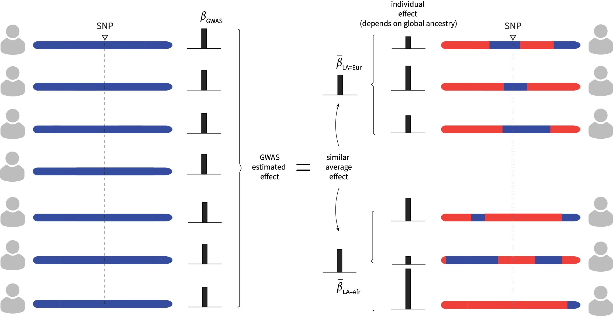

# Welcome to GxA Interactions

This repository contains code and data files for the following paper.

> A.J. Aw, R. Mandla, Z. Shi, Penn Medicine Biobank, B. Pasaniuc, I. Mathieson, "Hidden structure in polygenic scores and the challenge of disentangling ancestry interactions in admixed populations" (2025+)  

## Project Information

We describe quantitative models of gene-by-ancestry (GxA) interaction that encode gene-gene and gene-environment interactions. Ancestry modifications of effect sizes can arise from interaction with local ancestry or with global ancestry, giving rise to the local and global models. We perform mathematical analyses and simulations using [Penn Medicine Biobank](https://pmbb.med.upenn.edu/) (PMBB) genotypes to study the predictions of each model for causal effect similarity and polygenic score performance.

*Visualizing Global and Local models. Shown here are two-way admixed individual genomes painted by inferred local ancestries, with blue representing European ancestry and red representing African ancestry.*

We show in this work that 

1. Substantial heterogeneity in individual-level effects can arise from GxA interactions, while still maintaining highly correlated average causal effects across (local) ancestries. The latter observation was recently reported in [Hou et al. (2023) *Nature Genetics*](https://doi.org/10.1038/s41588-023-01338-6) and [Hu et al. (2025) *Nature Genetics*](http://doi.org/10.1038/s41588-024-02035-8)).
2. If causal variants are known and their effects are accurately estimated, then partial polygenic scores, which are computed on ancestry-specific genome segments, can distinguish the local and global models. 
3. If causal variants are unknown and tagging variants are used to compute polygenic scores, then differences in linkage disequilibrium (LD) across ancestries limit the ability of polygenic scores to distinguish the local model from the global model.

To obtain the first result, we analytically derive the correlation in average effect across local ancestries under the global model, and demonstrate on African American genotype data from PMBB that this correlation is high, despite pervasive heterogeneity in global ancestries between individuals. It is also possible to visualize this, as shown below.        

*Heterogeneity in causal effect between individuals is consistent with high correlation in causal effect across local ancestry.*

The second and third results rely on analytical formulas and simulations, for which we provide code that allows the user to explore numerics and replicate our findings.

## Organization

| Directory    | Description |
| -------- | ------- |
| `scripts`  | Code for running analyses |
| `manuscript`  | Code for generating manuscript figures |
| `data` | Result files for analyses performed on Biobanks |

## Quick Guide 

**Reproducing Manuscript Figures** 

Under `manuscript` we have provided a R Markdown document (`gen_figs.Rmd`), with code to generate all figures reported in the manuscript.

**Running Simulations**

R code to perform simulations under our quantitative models is available under `scripts`. 

- For R users, under `scripts/R` we have provided a R Markdown document to demonstrate how to use the R script.

A Python version is under development and will be released soon.