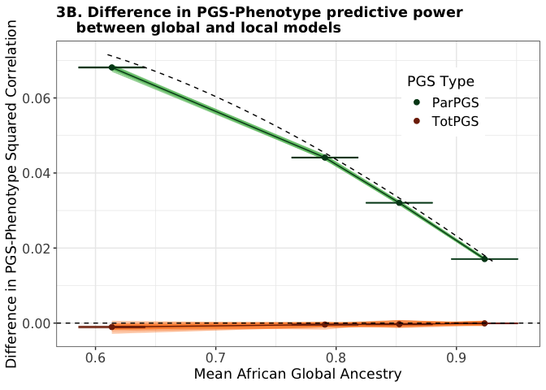

Generate Figures in Paper
================
Alan J. Aw

# Introduction

This notebook guides the reader in reproducing the figures in our paper.

``` r
#### Load libraries and define directories
library(dplyr)
library(ggplot2)

working_dir = "/Users/alanaw/Documents/Github/GxA_Interaction/"
```

# Figure 1: Schema of our Models and Methods

We produced this figure using LaTeX TikZ and Adobe Illustrator, so we’ll
skip it.

# Figure 2: Comparison of Average Effect Correlations by Model

Unzip `laacor.zip`. You should see the following subdirectory that
contains six CSV files:
`/GxA_Interaction/data/PMBB/simulations/simstudy2/laacor`. Code below
assumes this step has been executed.

``` r
#### Read result files and generate plot 
## Define directories and obtain list of files to read
single_pheno_names <- c("Body-Mass-Index",
                        "Neutrophil_Count",
                        "Platelet-counts",
                        "Standing-Height",
                        "Triglycerides",
                        "Weight")
laacor_dir <- paste0(working_dir, "data/PMBB/simulations/simstudy2/laacor/")
all_laacor_files <- system(paste0("ls ", laacor_dir,"*.csv"), intern=T)

## Read files
all_laacor_df <- do.call(rbind, 
                         lapply(1:6, function(i) {
                           res_df <- readr::read_csv(all_laacor_files[i]) # 042725 --> 042825
                           res_df$Phenotype <- rep(single_pheno_names[i],nrow(res_df))
                           return(res_df)
                         }))

## Summarize results 
ave_cor_melted <- all_laacor_df %>% 
  group_by(across(all_of(c("Rho","R2_Causal","Phenotype")))) %>% 
  summarise(MEAN_Global_LAACor_prime_hat=mean(Global_LAACor_prime_hat), 
            SE_Global_LAACor_prime_hat=sd(Global_LAACor_prime_hat),
            Global_LAACor_prime=mean(Mean_Global_LAACor_prime_j_True),
            MEAN_Local_LAACor_prime_hat=mean(Local_LAACor_prime_hat), 
            SE_Local_LAACor_prime_hat=sd(Local_LAACor_prime_hat),
            Local_LAACor_prime=mean(Mean_Local_LAACor_prime_j),
            MEAN_Global_LAACor_hat=mean(Global_LAACor_hat), 
            SE_Global_LAACor_hat=sd(Global_LAACor_hat),
            Global_LAACor=mean(Mean_Global_LAACor_j_True),
            MEAN_Local_LAACor_hat=mean(Local_LAACor_hat), 
            SE_Local_LAACor_hat=sd(Local_LAACor_hat),
            Local_LAACor=mean(Mean_Local_LAACor_j),
            N_REPS=n())

global_ave_cor_melted <- ave_cor_melted %>% select(c(Rho,R2_Causal,Phenotype,
                                                     Global_LAACor_prime,
                                                     MEAN_Global_LAACor_prime_hat,
                                                     SE_Global_LAACor_prime_hat,
                                                     Global_LAACor,
                                                     MEAN_Global_LAACor_hat,
                                                     SE_Global_LAACor_hat))
colnames(global_ave_cor_melted)[4:9] <- c("Causal","Emp_Causal","SE_Causal",
                                          "Tagging","Emp_Tagging","SE_Tagging")


global_ave_cor_melted$Model <- rep("Global Model", nrow(global_ave_cor_melted))
local_ave_cor_melted <- ave_cor_melted %>% select(c(Rho,R2_Causal,Phenotype,
                                                    Local_LAACor_prime,
                                                    MEAN_Local_LAACor_prime_hat,
                                                    SE_Local_LAACor_prime_hat,
                                                    Local_LAACor,
                                                    MEAN_Local_LAACor_hat,
                                                    SE_Local_LAACor_hat))
colnames(local_ave_cor_melted)[4:9] <- c("Causal","Emp_Causal","SE_Causal",
                                         "Tagging","Emp_Tagging","SE_Tagging")
local_ave_cor_melted$Model <- rep("Local Model", nrow(local_ave_cor_melted))

combined_ave_cor_melted <- rbind(global_ave_cor_melted,local_ave_cor_melted)
causal_ave_cor_melted <- combined_ave_cor_melted %>% 
  select(c(Rho,R2_Causal,Phenotype,Causal,Emp_Causal,SE_Causal,Model))
tag_ave_cor_melted <- combined_ave_cor_melted %>% 
  select(c(Rho,R2_Causal,Phenotype,Tagging,Emp_Tagging,SE_Tagging,Model))
colnames(causal_ave_cor_melted)[4:6] <- c("Param","Estimate","SE_Estimate")
colnames(tag_ave_cor_melted)[4:6] <- c("Param","Estimate","SE_Estimate")
causal_ave_cor_melted$Variant <- rep("Causal",nrow(causal_ave_cor_melted))
tag_ave_cor_melted$Variant <- rep("Tagging",nrow(tag_ave_cor_melted))
ave_cor_melted <- rbind(causal_ave_cor_melted,
                        tag_ave_cor_melted)
to_plot <- ave_cor_melted %>% 
  ungroup() %>%
  group_by(across(all_of(c("Rho","Model","Phenotype","Variant")))) %>%
  select(c("Rho","Estimate","Param","SE_Estimate","Phenotype","Variant","Model")) %>% 
  subset(Phenotype %in% c("Standing-Height", "Neutrophil_Count", "Triglycerides"))
to_plot <- distinct(to_plot, Rho,Model,Phenotype,Variant,.keep_all= TRUE)

#### Generate figure
## Create a list for labeller
pheno_names <- c(
  'Body-Mass-Index'="BMI",
  'Neutrophil_Count'="Neutrophil Count",
  'Platelet-counts'="Platelet Count",
  'Standing-Height'="Standing Height",
  'Triglycerides'="Triglycerides",
  'Weight'="Weight"
)

## Plot
ggplot(to_plot)+
  geom_point(aes(x=Rho,y=Estimate,
                 colour=Variant),
             alpha=0.66) +
  geom_line(aes(x=Rho,y=Param,
                group=Variant,
                colour=Variant),
           alpha=0.8,
           linewidth=0.6) +
  geom_errorbar(aes(x=Rho,
                    ymin=Estimate-1.96*SE_Estimate/sqrt(100),
                    ymax=Estimate+1.96*SE_Estimate/sqrt(100),
                    colour=Variant),
                alpha=0.66)+
  facet_grid(Model~Phenotype,scales="free_y",
             labeller=labeller(Phenotype=pheno_names)) +
  ylab("Genome-wide\n Local Ancestry Average Effect Correlation") +
  xlab("Causal Effect Correlation, \u03C1") +
  ggtitle("2. Comparison of Average Effect Correlations by Model") +
  scale_colour_manual(values=c("#7fc97f","#386cb0")) + 
  theme_bw() +
  theme(plot.title=element_text(face="bold",hjust=0.5),
        text=element_text(family="DejaVu Sans"),
        legend.title=element_blank(),
        strip.text=element_text(size=13),
        legend.text=element_text(size=12),
        axis.text=element_text(size=12),
        axis.title=element_text(size=13),
        legend.position="bottom")
```

<!-- -->

# Figure 3: Comparison of Polygenic Prediction by Model

Large zipped files in `GxA_Interaction/data/PMBB/simulations/` are
involved. Please follow instructions on downloading and/or unzipping
them to ensure smooth reproducibility.

## (Fig 3A) Behaviour of Prediction Accuracy as Function of Global African Ancestry

This is based on the Proposition in our paper, so it does not require
use of empirical data. You may change `r2_vec`, `rho_vec` and
`a_bar_vec` in the code chunk below to explore the shapes of the curves
for other values of these quantities.

``` r
#### Define functions based on formulae in Proposition
## Function for E[cor(totPGS,y)^2] under either model 
getTotPGS = function(r2,rho,a_bar) {
  r2*(1-a_bar+rho*a_bar)^2
}
## Function for E[cor(parPGS,y)^2] under Global Model
getParPGSGlo = function(r2,rho,a_bar) {
  r2*(1-a_bar+rho*a_bar)^2*(1-a_bar)
}
## Function for E[cor(parPGS,y)^2] under Local Model
getParPGSLoc = function(r2,a_bar) {
  r2*(1-a_bar)
}

#### Generate range of African global ancestry and parameter values and compute functions
## Generate range of values 
r2_vec = c(0.5)
rho_vec = c(0,0.1,0.3,0.5,0.7,0.9)
a_bar_vec = seq(0.01,0.99,length.out=200)
parPGS_loc_config_df = expand.grid(r2_vec,a_bar_vec)
colnames(parPGS_loc_config_df) = c("R2","A_BAR")
param_config_df = expand.grid(r2_vec,rho_vec,a_bar_vec) 
colnames(param_config_df) = c("R2","RHO","A_BAR")

## Compute functions
parPGS_loc_config_df$ParPGS = mapply(getParPGSLoc,
                                     parPGS_loc_config_df$R2,
                                     parPGS_loc_config_df$A_BAR)
parPGS_loc_config_df$R2 = paste0("r\u00B2 = ",parPGS_loc_config_df$R2)
param_config_df$ParPGS = mapply(getParPGSGlo,
                                param_config_df$R2,
                                param_config_df$RHO,
                                param_config_df$A_BAR)
param_config_df$TotPGS = mapply(getTotPGS,
                                param_config_df$R2,
                                param_config_df$RHO,
                                param_config_df$A_BAR)
param_config_df$R2 = paste0("r\u00B2 = ",param_config_df$R2)

#### Generate figure
the_colors = c("#F15A29","#00A79D","black")
the_labels = c("ParPGS (Global)", "ParPGS (Local)", "TotPGS")
color_df = data.frame(COLORS=the_colors,
                      LABELS=the_labels)

## Plot
ggplot() +
  geom_line(data=param_config_df,
            aes(x=A_BAR,
                y=ParPGS,
                group=RHO,
                alpha=RHO),
            colour="#F15A29") +
  geom_line(data=param_config_df,
            aes(x=A_BAR,
                y=TotPGS,
                group=RHO,
                alpha=RHO),
            colour="black") +
  geom_line(data=parPGS_loc_config_df,
            aes(x=A_BAR,
                y=ParPGS),
            colour="#00A79D") +
  facet_wrap(.~R2) +
  theme_bw() +
  scale_alpha(name = "\u03C1",
              breaks=c(0,0.1,0.3,0.5,0.7,0.9),
              labels=c(0,0.1,0.3,0.5,0.7,0.9)) +
  scale_x_continuous(breaks=c(0,0.25,0.5,0.75,1), 
                   labels=c("0","0.25","0.5","0.75","1"), 
                   limits=c(0,1)) +
  xlab("Mean African Global Ancestry") +
  ylab("Expected Squared Correlation\n Between Polygenic Score and Phenotype") +
  ggtitle("3A. Analytical behaviour of PGS predictive power") +
  theme(plot.title=element_text(face="bold"),
        text=element_text(family="DejaVu Sans"),
        legend.title=element_text(size=13),
        legend.text=element_text(size=12),
        axis.text=element_text(size=12),
        axis.title=element_text(size=13))
```

<!-- -->

## (Fig 3B) Difference in PGS-Phenotype Correlation between Models

Unzip `correlations.zip`. You should see the following subdirectory that
contains two CSV files:
`/GxA_Interaction/data/PMBB/simulations/simstudy1/correlations`. Code
below assumes this step has been executed.

``` r
#### Read result files and compute difference in correlations between models
## Read ParPGS file
parPGS_df = readr::read_csv(
  paste0(working_dir,"data/PMBB/simulations/simstudy1/correlations/cor_parPGS_y.csv"))
## Compute differences in ParPGS correlations and take averages across seed-reps
par_summary_df = parPGS_df %>% group_by(a_bar,r2,rho,Quantile,Seed) %>% 
  summarise(Diff_Expected=mean(Local_Expected-Global_Expected),
            Diff_Observed=mean(Local_Observed-Global_Observed),
            Diff_SE=sqrt(var(Local_Observed)/100+var(Global_Observed)/100))
par_summary_df$r2 = paste0("r\u00b2 = ",par_summary_df$r2)
par_summary_df$rho = paste0("\u03c1 = ",par_summary_df$rho)
par_summary_df_seed_average = par_summary_df %>% group_by(Seed,a_bar,Quantile) %>%
  summarise(Diff_Observed=mean(Diff_Observed))
## Take average across seeds 
par_summary_df_grand_average = par_summary_df_seed_average %>% group_by(Quantile) %>%
  summarise(Mean_Diff_Observed=mean(Diff_Observed),
            SE_Diff_Observed=sd(Diff_Observed)/sqrt(50),
            Mean_a_bar=mean(a_bar),
            SE_a_bar=sd(a_bar)/sqrt(50))
## Read TotPGS file
totPGS_df = readr::read_csv(
  paste0(working_dir,"data/PMBB/simulations/simstudy1/correlations/cor_totPGS_y.csv"))
## Compute differences in TotPGS correlations and take averages across seed-reps
tot_summary_df = totPGS_df %>% group_by(a_bar,r2,rho,Quantile,Seed) %>% 
  summarise(Diff_Expected=mean(Local_Expected-Global_Expected),
            Diff_Observed=mean(Local_Observed-Global_Observed),
            Diff_SE=sqrt(var(Local_Observed)/100+var(Global_Observed)/100))
tot_summary_df$r2 = paste0("r\u00b2 = ",tot_summary_df$r2)
tot_summary_df$rho = paste0("\u03c1 = ",tot_summary_df$rho)
tot_summary_df_seed_average = tot_summary_df %>% group_by(Seed,a_bar,Quantile) %>%
  summarise(Diff_Observed=mean(Diff_Observed))
## Take average across seeds 
tot_summary_df_grand_average = tot_summary_df_seed_average %>% group_by(Quantile) %>%
  summarise(Mean_Diff_Observed=mean(Diff_Observed),
            SE_Diff_Observed=sd(Diff_Observed)/sqrt(50),
            Mean_a_bar=mean(a_bar),
            SE_a_bar=sd(a_bar)/sqrt(50))
## Combine ParPGS and TotPGS dataframes
par_summary_df_seed_average$PGS = rep("ParPGS", 
                                      nrow(par_summary_df_seed_average))
tot_summary_df_seed_average$PGS = rep("TotPGS", 
                                      nrow(tot_summary_df_seed_average))
par_summary_df_grand_average$PGS = rep("ParPGS",
                                       nrow(par_summary_df_grand_average))
tot_summary_df_grand_average$PGS = rep("TotPGS",
                                       nrow(tot_summary_df_grand_average))
summary_df_seed_average = rbind(par_summary_df_seed_average,
                                tot_summary_df_seed_average)
summary_df_grand_average = rbind(par_summary_df_grand_average,
                                 tot_summary_df_grand_average)

#### Compute analytical difference based on Proposition in paper
## Create analytical curves (Local- Global expected squared correlation)
getExpSqCorDiff = function(r2,rho,a_bar) {
  return(r2*(1-a_bar)*(1-(1-a_bar+rho*a_bar)^2))
}
getMeanExpSqCor = function(a_bar) {
  score_vec <- c()
  for (R2 in c(0.001,0.01,0.2,0.4,0.6,0.8)) {
    for (RHO in c(0,0.1,0.3,0.5,0.7,0.9)) {
      score_vec <- c(score_vec, getExpSqCorDiff(r2=R2,rho=RHO,a_bar=a_bar))
    }
  }
  return(mean(score_vec))
}

mean_squared_cor = sapply(seq(from=0.61,to=0.93,length.out=200), 
                           getMeanExpSqCor)

analytical_df = data.frame(a_bar=seq(from=0.61,to=0.93,length.out=200),
                            MSC=mean_squared_cor)

#### Generate figure
ggplot() +
  geom_line(data=par_summary_df_seed_average,
            aes(x=a_bar,
                y=Diff_Observed,
                group=Seed),
            colour="#74c476",alpha=0.5) + 
  geom_line(data=par_summary_df_grand_average,
            aes(x=Mean_a_bar,
                y=Mean_Diff_Observed),
            colour="#00441b") +
  geom_errorbar(data=par_summary_df_grand_average,
                aes(x=Mean_a_bar,
                    ymin=Mean_Diff_Observed-2*SE_Diff_Observed,
                    ymax=Mean_Diff_Observed+2*SE_Diff_Observed),
                colour="#00441b") +
  geom_line(data=tot_summary_df_seed_average,
            aes(x=a_bar,
                y=Diff_Observed,
                group=Seed),
            colour="#fd8d3c",alpha=0.5) + 
  geom_line(data=tot_summary_df_grand_average,
            aes(x=Mean_a_bar,
                y=Mean_Diff_Observed),
            colour="#7f2704") +
  geom_errorbar(data=tot_summary_df_grand_average,
                aes(x=Mean_a_bar,
                    ymin=Mean_Diff_Observed-2*SE_Diff_Observed,
                    ymax=Mean_Diff_Observed+2*SE_Diff_Observed),
                colour="#7f2704") +
  geom_point(data=summary_df_grand_average,
             aes(x=Mean_a_bar,
                 y=Mean_Diff_Observed,
                 colour=PGS),
             size=2) +
  theme_bw() +
  geom_line(data=analytical_df,
            aes(x=a_bar,y=MSC),
            lty="dashed") +
  geom_hline(yintercept=0,lty="dashed")+
  scale_colour_manual("PGS Type",
    values=c("#00441b","#7f2704")) +
  xlab(expression(paste("Mean African Global Ancestry"))) + 
  ylab("Difference in PGS-Phenotype Squared Correlation") +
  ggtitle("3B. Difference in PGS-Phenotype predictive power\n    between global and local models") +
  theme(plot.title=element_text(face="bold"),
        text=element_text(family="DejaVu Sans"),
        legend.title=element_text(size=13),
        legend.text=element_text(size=12),
        axis.text=element_text(size=12),
        axis.title=element_text(size=13),
        legend.position=c(.8,.8))
```

<!-- -->

## (Fig 3C) Distinguishability of Models from Tagging Variant PGS

Unzip `batch_sim.zip`. You should see the following subdirectory:
`/GxA_Interaction/data/PMBB/simulations/simstudy2/batch_sim`. Code below
assumes this step has been executed.

``` r
#### Helper function for performing Wilcoxon rank sum tests 
computeWilcoxP <- function(df) {
  df %>%
    group_by(Rho, R2_Causal, Phenotype) %>%
    summarise(
      cor2_y_parPGS_Wilcox_PVAL = {
        # Split the data by Model within the group
        models <- split(cor2_y_parPGS_demean, Model)
        
        # Only perform the test if there are exactly two groups
        if (length(models) == 2) {
          test_result <- wilcox.test(models[[1]], models[[2]], 
                                     alternative = "two.sided")
          test_result$p.value
        } else {
          NA_real_  # Return NA if the test can't be performed
        }
      },
      cor2_y_totPGS_Wilcox_PVAL = {
        # Split the data by Model within the group
        models <- split(cor2_y_totPGS_demean, Model)
        
        # Only perform the test if there are exactly two groups
        if (length(models) == 2) {
          test_result <- wilcox.test(models[[1]], models[[2]], 
                                     alternative = "two.sided")
          test_result$p.value
        } else {
          NA_real_  # Return NA if the test can't be performed
        }
      },
      .groups = "drop"
    )
}

#### Read result files and run two-sample tests 
## Define directories and obtain list of files to read
batch1_dir <- paste0(working_dir, 
                     "data/PMBB/simulations/simstudy2/batch_sim/batch1/")
batch2_dir <- paste0(working_dir, 
                     "data/PMBB/simulations/simstudy2/batch_sim/batch2/")
batch3_dir <- paste0(working_dir, 
                     "data/PMBB/simulations/simstudy2/batch_sim/batch3/")
batch4_dir <- paste0(working_dir, 
                     "data/PMBB/simulations/simstudy2/batch_sim/batch4/")

batch1_files <- system(paste0("ls ", batch1_dir,
                              "*_all_diagnostic_results.csv"), intern=T)
batch2_files <- system(paste0("ls ", batch2_dir,
                              "*_all_diagnostic_results.csv"), intern=T)
batch3_files <- system(paste0("ls ", batch3_dir,
                              "*_all_diagnostic_results.csv"), intern=T)
batch4_files <- system(paste0("ls ", batch4_dir,
                              "*_all_diagnostic_results.csv"), intern=T)

pheno_names <- c("Body-Mass-Index","Body-Mass-Index",
                 "Neutrophil_Count","Neutrophil_Count",
                 "Platelet-counts","Platelet-counts",
                 "Standing-Height","Standing-Height",
                 "Triglycerides","Triglycerides",
                 "Weight","Weight")
global_local <- rep(c("global","local"),6)

## Read files
batch1_res_df <- do.call(rbind, 
                             lapply(1:12, function(i) {
                               res_df <- readr::read_csv(batch1_files[i])
                               res_df$Phenotype <- rep(pheno_names[i],nrow(res_df))
                               res_df$Model <- rep(global_local[i],nrow(res_df))
                               return(res_df)
                             }))
batch2_res_df <- do.call(rbind, 
                             lapply(1:12, function(i) {
                               res_df <- readr::read_csv(batch2_files[i])
                               res_df$Phenotype <- rep(pheno_names[i],nrow(res_df))
                               res_df$Model <- rep(global_local[i],nrow(res_df))
                               return(res_df)
                             }))
batch3_res_df <- do.call(rbind, 
                             lapply(1:12, function(i) {
                               res_df <- readr::read_csv(batch3_files[i])
                               res_df$Phenotype <- rep(pheno_names[i],nrow(res_df))
                               res_df$Model <- rep(global_local[i],nrow(res_df))
                               return(res_df)
                             }))
batch4_res_df <- do.call(rbind, 
                             lapply(1:12, function(i) {
                               res_df <- readr::read_csv(batch4_files[i])
                               res_df$Phenotype <- rep(pheno_names[i],nrow(res_df))
                               res_df$Model <- rep(global_local[i],nrow(res_df))
                               return(res_df)
                             }))
all_res_df <- rbind(batch1_res_df,
                    batch2_res_df,
                    batch3_res_df,
                    batch4_res_df)

## Summarize results 
pval_df <- computeWilcoxP(all_res_df)
pval_df_melt <- pval_df %>% reshape2::melt(
  id.vars=c("Rho","R2_Causal","Phenotype"))
pval_df_melt$variable <- ifelse(grepl(
  "parPGS",pval_df_melt$variable),"ParPGS","TotPGS")
pval_df_melt$loglogP <- log10(-log10(pval_df_melt$value))
pval_df_melt$neglogP <- -log10(pval_df_melt$value)
pval_df_melt$Significant <- (pval_df_melt$neglogP > -log10(0.01))

## Prepare dataframe for plotting
# Step 1: Create bins
df_binned <- pval_df_melt %>%
  mutate(
    R2_bin = cut(R2_Causal, breaks = seq(0, 0.75, length.out = 50), include.lowest = TRUE),
    Rho_bin = cut(Rho, breaks = seq(0, 1, length.out = 50), include.lowest = TRUE)
  ) %>%
  group_by(R2_bin, Rho_bin, variable) %>%
  summarize(
    prop_significant = mean(Significant, na.rm = TRUE),
    .groups = "drop"
  )

# Step 2: Extract numeric bin centers for plotting
df_binned <- df_binned %>%
  mutate(
    R2_center = (as.numeric(sub("\\((.+),.*", "\\1", R2_bin)) + 
                   as.numeric(sub("[^,]*,([^]]*)\\]", "\\1", R2_bin))) / 2,
    Rho_center = (as.numeric(sub("\\((.+),.*", "\\1", Rho_bin)) + 
                    as.numeric(sub("[^,]*,([^]]*)\\]", "\\1", Rho_bin))) / 2
  )

#### Generate figure
## Main 3C
ggplot(df_binned, aes(x = R2_center, y = Rho_center, fill = prop_significant)) +
  geom_tile(color = "white") +
  scale_fill_gradientn(
    colors = c("darkred", "red", "#74c476"),
    limits=c(0, 1),
    breaks=c(0,0.25,0.5,0.75,1),
    labels = c("0","0.25","0.5","0.75","1"),
    name = "Proportion\nSignificantly\nDifferent"
  ) +
  facet_wrap(~ variable, ncol = 2) +
  coord_cartesian(xlim = c(0, 0.75),
                  ylim = c(0.2, 1)) +
  scale_x_continuous(limits=c(0,0.75),
                     breaks=seq(0,0.75,0.15),
                     labels=seq(0,0.75,0.15)) +
  theme_bw() +
  labs(title = "3C. Distinguishability of global and local models\n     from tagging variant PGS",
       x = "Causal Variant r\u00B2",
       y = "Causal Effect Correlation, \u03C1") +
  theme(plot.title = element_text(face = "bold"),
        text=element_text(family="DejaVu Sans"),
        legend.position="right",
        legend.title=element_text(size=13),
        strip.text=element_text(size=12),
        legend.text=element_text(size=12),
        axis.text=element_text(size=12),
        axis.title=element_text(size=13)) 
```

<!-- -->

``` r
## Inset
ggplot(df_binned %>% 
         subset(R2_center <= 0.15 & Rho_center >= 0.9 & variable=="ParPGS"), 
       aes(x = R2_center, y = Rho_center, fill = prop_significant)) +
  geom_tile(color = "white") +
  scale_fill_gradientn(
    colors = c("darkred", "red", "#74c476"),
    limits = c(0, 1),
    name = "Proportion\nSignificantly Different"
  ) +
  coord_cartesian(xlim = c(0.015, 0.15),
                  ylim = c(0.9, 1)) +
  scale_x_continuous(limits=c(0.015,0.2),
                     breaks=seq(0,0.15,0.03),
                     labels=c("0",".03",".06",".09",".12",".15")) +
  scale_y_continuous(limits=c(0.895,1.05),
                     breaks=seq(0.9,1,0.025),
                     labels=c(".9",".925",".95",".975","1")) +
  theme_bw(base_size = 25) +
  theme(legend.position="None",
        text=element_text(family="DejaVu Sans"))+
  labs(
    title = "Inset of Fig 3C",
    x = "r\u00B2",
    y = "\u03C1"
  )
```

<!-- -->

## (Fig 3D) Relative Predictive Power of ParPGS under Local Model

Code below assumes that the chunk for reproducing Figure 3C has been
executed.

``` r
#### Compute relative predictive power of ParPGS
all_res_df$Ratio <- all_res_df$cor2_y_parPGS_demean/
  all_res_df$cor2_y_totPGS_demean
all_res_df$E_Ratio <- all_res_df$E_cor2_y_parPGS_demean/
  all_res_df$E_cor2_y_totPGS_demean

all_res_df_reshape <- all_res_df %>% 
  group_by(across(all_of(c("Rho","R2_Causal","Model","Phenotype")))) %>% 
  summarise(MEAN_Eur_Afr_Tag_Cor=mean(cor_eur_tag_afr_tag), 
            SE_Eur_Afr_Tag_Cor=sd(cor_eur_tag_afr_tag),
            MEAN_Cor2_Y_ParPGS=mean(cor2_y_parPGS_demean),
            SD_Cor2_Y_ParPGS=sd(cor2_y_parPGS_demean),
            E_Cor2_Y_ParPGS=mean(E_cor2_y_parPGS_demean),
            MEAN_Cor2_Y_TotPGS=mean(cor2_y_totPGS_demean),
            SD_Cor2_Y_TotPGS=sd(cor2_y_totPGS_demean),
            E_Cor2_Y_TotPGS=mean(E_cor2_y_totPGS_demean),
            MEAN_Ratio=mean(Ratio),
            SD_Ratio=sd(Ratio),
            E_Ratio=mean(E_Ratio),
            SD_E_Ratio=sd(E_Ratio))

#### Generate figure
ggplot(all_res_df_reshape %>% 
         subset(Phenotype=="Standing-Height" & Rho <= 0.9 & Model=="local"),
       aes(x=R2_Causal, y=Rho)) +
  geom_tile(aes(fill=MEAN_Ratio)) +
  scale_fill_gradient2(
    low="#4d4d4d",
    mid="#ffffff",
    high="#b2182b",
    midpoint = 1,
    name = "[Cor(ParPGS,Y)/\nCor(TotPGS,Y)]\u00B2") +
  theme_classic() +
  scale_x_continuous(limits=c(0.13,0.74),
                     breaks=seq(0.15,0.75,0.1),
                     labels=seq(0.15,0.75,0.1)) +
  scale_y_continuous(limits=c(0.17,0.93),
                     breaks=seq(0.2,0.9,0.1),
                     labels=seq(0.2,0.9,0.1)) +
  ylab("Causal Effect Correlation, \u03C1") +
  xlab("Causal Variant r\u00B2") +
  ggtitle("3D. Relative predictive power of ParPGS under local model") +
  theme(plot.title=element_text(face = "bold"),
        text=element_text(family="DejaVu Sans"),
        axis.title=element_text(size=14),
        axis.text=element_text(size=13))
```

<!-- -->
