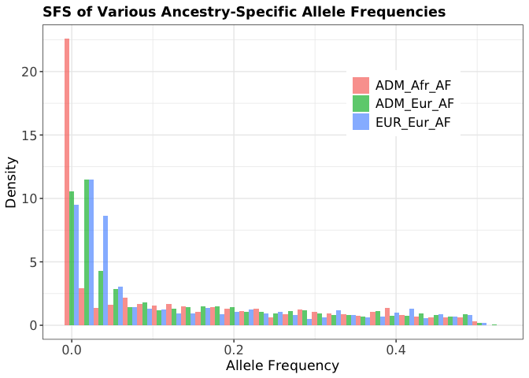

Example of Script Usage
================
Alan J. Aw

# Introduction

This notebook performs simple simulations based on summary data obtained
from the Penn Medicine Biobank. Using simulated genotypes and
phenotypes, as well as functions from our companion script, we will
explore both the local ancestry average causal effect correlation
(LAACor) and performance of polygenic scores. Another purpose of this
notebook is to demonstrate how functions in our script can be used to
numerically investigate the mathematical results presented in our paper.

``` r
#### Load libraries and define directories
library(dplyr)
library(ggplot2)
library(tidyr)

working_dir = "/Users/alanaw/Documents/Github/GxA_Interaction/"
```

> **Executive Summary.** We simulate genotypes and phenotypes for both
> unadmixed European ancestry individuals and two-way African and
> European admixed individuals. A phenotype for which polygenic score
> explains $`20`$% of the overall variance is simulated. Both the local
> model and the global model are simulated. The local ancestry average
> causal effect correlation and the performance of both partial and
> total polygenic scores are compared between the local and global
> models.

# Synthetic Data Simulation

We first simulate two cohorts: one is unadmixed of European ancestry
(EUR), the other is two-way admixed with African and European ancestries
(ADM). We will use ancestry-specific allele frequencies computed from
Penn Medicine Biobank across $`1,563`$ approximately independent SNPs.
For the ADM cohort, local ancestry assignment at each locus will rely on
local ancestry fractions computed across the same $`1,563`$ SNPs. We
simulate $`30,000`$ EUR individuals to mimic the EUR cohort size in
PMBB. To save time for purposes of demonstration, we will simulate just
$`5,000`$ ADM individuals.

``` r
#### Load allele frequencies and local ancestry fractions 
## MAF and LANC fracs from Seed 1 of our simulations were computed beforehand
## Unadmixed MAF estimated from 29,410 individuals of PMBB EUR cohort
## Ancestry-specific MAFs estimated from 9,324 individuals of PMBB ADM cohort
maf_df = readr::read_csv(paste0(working_dir,
                                "scripts/R/example_sumstats/example_maf.csv"))
lanc_frac_df = readr::read_csv(paste0(working_dir,
                                "scripts/R/example_sumstats/example_lanc_frac.csv"))

#### Simulate ADM and EUR cohorts
## Helper functions
getADMCohort = function(n, eur_maf, afr_maf, h1_lanc, h2_lanc) {
  # Generate nx2p Afr lanc matrix 
  h1_lanc_mat <- sapply(h1_lanc, function(prob) rbinom(n, size = 1, prob = prob))
  h2_lanc_mat <- sapply(h2_lanc, function(prob) rbinom(n, size = 1, prob = prob))
  lanc_mat <- cbind(h1_lanc_mat,h2_lanc_mat)
  
  # Using lanc matrix, generate nx2p hap matrix
  eur_all_dos <- sapply(c(eur_maf,eur_maf), 
                        function(prob) rbinom(n, size = 1, prob = prob))
  afr_all_dos <- sapply(c(afr_maf,afr_maf), 
                        function(prob) rbinom(n, size = 1, prob = prob))
  hap_mat <- lanc_mat*afr_all_dos + (1-lanc_mat)*eur_all_dos
  
  # Return list of nx2p matrices
  return(list(LANC=lanc_mat,
              HAP=hap_mat))
}

getEURCohort = function(n, maf) {
  # Return nxp genotype matrix of haplotype allele dosages 
  return(sapply(maf, 
                function(prob) rbinom(n, size = 2, prob = prob)))
}

## Set seed for simulation of genotypes
set.seed(2025)

## ADM cohort
adm_cohort = getADMCohort(n=5000,
                          eur_maf=maf_df$ADM_Eur_AF,
                          afr_maf=maf_df$ADM_Afr_AF,
                          h1_lanc=lanc_frac_df$ADM_Afr_Hap1_LANC_Frac,
                          h2_lanc=lanc_frac_df$ADM_Afr_Hap2_LANC_Frac)
## EUR cohort
eur_cohort = getEURCohort(n=30000,
                          maf=maf_df$EUR_Eur_AF)
```

## Quick Summary of Simulated Cohort

Let us visualize simple summary statistics from our simulation.

First we can visualize the sample frequency spectrum (SFS), a histogram
of allele frequencies. We see that the Eur-LANC allele frequencies are
distributed more closely to the EUR allele frequencies.

``` r
#### Get sample allele frequencies 
EUR_samp_af <- colMeans(eur_cohort[,1:1563])/2
ADM_afr_masked_mat <- adm_cohort$LANC*adm_cohort$HAP
ADM_eur_masked_mat <- (1-adm_cohort$LANC)*adm_cohort$HAP
ADM_samp_eur_num <- colSums(ADM_eur_masked_mat[,1:1563])+colSums(ADM_eur_masked_mat[,1564:3126])
ADM_samp_eur_denom <- colSums((1-adm_cohort$LANC)[,1:1563])+colSums((1-adm_cohort$LANC)[,1564:3126])
ADM_samp_eur_af <- ADM_samp_eur_num/ADM_samp_eur_denom
ADM_samp_afr_num <- colSums(ADM_afr_masked_mat[,1:1563])+colSums(ADM_afr_masked_mat[,1564:3126])
ADM_samp_afr_denom <- colSums(adm_cohort$LANC[,1:1563])+colSums(adm_cohort$LANC[,1564:3126])
ADM_samp_afr_af <- ADM_samp_afr_num/ADM_samp_afr_denom

samp_maf_df <- data.frame(EUR_Eur_AF=EUR_samp_af,
                          ADM_Eur_AF=ADM_samp_eur_af,
                          ADM_Afr_AF=ADM_samp_afr_af)
#### Generate SFS
## require(tidyr)
## Reshape data frame to long format
df_long = samp_maf_df %>%
  pivot_longer(cols = everything(), names_to = "Variable", values_to = "Value")

## Plot 
ggplot(df_long, aes(x = Value, fill = Variable)) +
  geom_histogram(aes(y=after_stat(density)),
                 position = "dodge", bins = 30, alpha = 0.7) +
  labs(title = "SFS of Various Ancestry-Specific Allele Frequencies",
       x = "Allele Frequency",
       y = "Density") +
  theme_bw() +
  theme(legend.title = element_blank(),
        legend.position = c(0.75,0.75),
        plot.title=element_text(face="bold"),
        text=element_text(family="DejaVu Sans"),
        legend.text=element_text(size=12),
        axis.text=element_text(size=12),
        axis.title=element_text(size=13))
```

    ## Warning: A numeric `legend.position` argument in `theme()` was deprecated in ggplot2
    ## 3.5.0.
    ## ℹ Please use the `legend.position.inside` argument of `theme()` instead.
    ## This warning is displayed once every 8 hours.
    ## Call `lifecycle::last_lifecycle_warnings()` to see where this warning was
    ## generated.

<!-- -->

Next let us look at the correlation of allele frequencies by local
ancestry, and also between the summary statistic file and simulated
genotypes. High correlations are observed between simulated genotype
allele frequency quantities and the corresponding quantities in the
summary statistic file. There is also good agreement between
correlations obtained from comparing summary statistic allele
frequencies and correlations obtained from comparing simulated genotype
allele frequencies.

``` r
#### Compare sample and summary statistic allele frequencies
print(paste0("Correlation in allele frequencies between EUR summary stats and sample = ",
             sprintf("%.5f",cor(EUR_samp_af, maf_df$EUR_Eur_AF))))
```

    ## [1] "Correlation in allele frequencies between EUR summary stats and sample = 0.99997"

``` r
print(paste0("Correlation in allele frequencies between ADM Eur summary stats and sample = ",
             sprintf("%.5f",cor(ADM_samp_eur_af, maf_df$ADM_Eur_AF))))
```

    ## [1] "Correlation in allele frequencies between ADM Eur summary stats and sample = 0.99895"

``` r
print(paste0("Correlation in allele frequencies between ADM Afr summary stats and sample = ",
             sprintf("%.5f",cor(ADM_samp_afr_af, maf_df$ADM_Afr_AF))))
```

    ## [1] "Correlation in allele frequencies between ADM Afr summary stats and sample = 0.99974"

``` r
#### Compare correlations by local ancestry in sample, and also in summary stats
print(paste0("In simulated data, correlation in AF by local ancestry = ", 
             sprintf("%.4f",cor(ADM_samp_afr_af, ADM_samp_eur_af)), 
             "; in summary statistics the correlation = ",
             sprintf("%.4f",cor(maf_df$ADM_Eur_AF, maf_df$ADM_Afr_AF))))
```

    ## [1] "In simulated data, correlation in AF by local ancestry = 0.8182; in summary statistics the correlation = 0.8185"

``` r
print(paste0("In simulated data, correlation in AF between EUR and Eur-LANC chunks = ", 
             sprintf("%.4f",cor(EUR_samp_af, ADM_samp_eur_af)), 
             "; in summary statistics the correlation = ",
             sprintf("%.4f",cor(maf_df$ADM_Eur_AF, maf_df$EUR_Eur_AF))))
```

    ## [1] "In simulated data, correlation in AF between EUR and Eur-LANC chunks = 0.9245; in summary statistics the correlation = 0.9259"

## Phenotype Simulation

Given our simulated genotypes, we are ready to simulate causal effects
and phenotypes under the local and global models.

``` r
#### Source R script
source(paste0(working_dir, 
              "scripts/R/PMBB_sim_master_script_geno_AFs_vers_100724.R"))

#### Generate admixed haps list 
#### This is used for downstream calculations  
ADMIXED_HAPS_LIST = getAdmixedHapList(admixed_haps=adm_cohort$HAP, 
                                      afr_ancs=adm_cohort$LANC)

#### Model effects
## Define parameters of quantitative model for simulating effect sizes
r2 = 0.2
rho = 0.3 
n_markers=1563
mix_type=NULL

## Set seed
set.seed(2025)

## Generate beta vector
## source = Eur, target = ADM Afr
beta_vecs = simPopBetas(n_markers=n_markers,r2=r2,cross_pop_rho=rho)
spop_beta_vec = beta_vecs[["SOURCE_POP_BETA_VEC"]]/
  sqrt(sum(samp_maf_df$ADM_Eur_AF*(1-samp_maf_df$ADM_Eur_AF)))
spop_beta_vec = c(spop_beta_vec,spop_beta_vec)
tpop_beta_vec = beta_vecs[["TARGET_POP_BETA_VEC"]]/
  sqrt(sum(samp_maf_df$ADM_Afr_AF*(1-samp_maf_df$ADM_Afr_AF)))
tpop_beta_vec = c(tpop_beta_vec,tpop_beta_vec)

#### Simulate ADM and EUR cohort phenotypes
## ADM cohort phenotypes
## This follows the steps in Lines 1158-1187 of the R script above
sim_pgs_local = simPGS2(r2=r2,
                        cross_pop_rho=rho,
                        admixed_haps_list=ADMIXED_HAPS_LIST,
                        source_pop_beta_vec=spop_beta_vec,
                        target_pop_beta_vec=tpop_beta_vec,
                        model="local",
                        lambda=NULL)
# [!] To access simulated phenotype: try str(sim_pgs_local)
sim_pgs_global = simPGS2(r2=r2,
                        cross_pop_rho=rho,
                        admixed_haps_list=ADMIXED_HAPS_LIST,
                        source_pop_beta_vec=spop_beta_vec,
                        target_pop_beta_vec=tpop_beta_vec,
                        model="global",
                        lambda=NULL)
```

## Local Ancestry Average Causal Effect Correlation

We calculate the empirical correlation of average causal effects by
local ancestry, across all markers. We compare this quantity against the
analytical approximation of the Local Ancestry Average Causal Effect
Correlation (LAACor) across all markers, which is reported in
Proposition 4.1 of our paper. The formulas for LAACor under the global
and local models are also provided in Box C of the Supplementary
Material of our paper.

``` r
#### Helper function for calculating LAACor under the Global Model
getOmegas <- function(adm_cohort_list) {
  # Extract fixed data objects
  afr_A_prime <- adm_cohort_list$CAUSAL_LANC # n x 2p
  eur_A_prime <- 1-afr_A_prime
  causal_hap_mat <- adm_cohort_list$CAUSAL_HAP # n x 2p
  n_vars <- ncol(afr_A_prime)/2
  n_inds <- nrow(afr_A_prime)
  # Get haplotype-specific causal ancestry matrices 
  afr_A_prime_1 <- afr_A_prime[,1:n_vars]
  afr_A_prime_2 <- afr_A_prime[,(n_vars+1):(2*n_vars)]
  
  # Get global Afr ancestry matrix
  ind_global_anc_prime_vec <- rowMeans(afr_A_prime,na.rm=T) # global Afr ancestry based on causal loci 
  message(date(), 
          ": Mean global ancestry computed using causal variants = ",
          mean(ind_global_anc_prime_vec))
  
  ind_global_anc_mat <- matrix(rep(ind_global_anc_prime_vec, times = n_vars), # n x p
                               nrow = length(ind_global_anc_prime_vec), ncol = n_vars)
  
  # Calculate hat_a_j_prime
  hat_a_j_prime_1 <- colMeans(afr_A_prime_1,na.rm=T) # p x 1
  hat_a_j_prime_2 <- colMeans(afr_A_prime_2,na.rm=T) # p x 1
  
  # Compute numerator and denominator of omega terms
  omega1_prime_num <- colSums((afr_A_prime_1+afr_A_prime_2)*(1-ind_global_anc_mat),
                              na.rm=T)
  omega2_prime_num <- colSums((afr_A_prime_1+afr_A_prime_2)*ind_global_anc_mat,
                              na.rm=T)
  omega3_prime_num <- colSums((2-afr_A_prime_1-afr_A_prime_2)*(1-ind_global_anc_mat),
                              na.rm=T)
  omega4_prime_num <- colSums((2-afr_A_prime_1-afr_A_prime_2)*ind_global_anc_mat,
                              na.rm=T)
  omega12_prime_denom <- n_inds*(hat_a_j_prime_1+hat_a_j_prime_2)
  omega34_prime_denom <- n_inds*(2-hat_a_j_prime_1-hat_a_j_prime_2)
  
  # Return 
  to_return <- data.frame(OMEGA1_PRIME=omega1_prime_num/omega12_prime_denom,
                          OMEGA2_PRIME=omega2_prime_num/omega12_prime_denom,
                          OMEGA3_PRIME=omega3_prime_num/omega34_prime_denom,
                          OMEGA4_PRIME=omega4_prime_num/omega34_prime_denom)
}

#### Global Model Calculations
## Get empirical correlation 
ind_causal_glo_AFR_anc <- rowMeans(ADMIXED_HAPS_LIST[["TARGET_POP_ANC_MAT"]],na.rm=T)
afr_A_prime_1 <- ADMIXED_HAPS_LIST[["TARGET_POP_ANC_MAT"]][,1:n_markers]
afr_A_prime_2 <- ADMIXED_HAPS_LIST[["TARGET_POP_ANC_MAT"]][,(n_markers+1):(2*n_markers)]

mixed_beta_prime_mat <- outer((1-ind_causal_glo_AFR_anc),spop_beta_vec[1:n_markers]) + 
  outer(ind_causal_glo_AFR_anc,tpop_beta_vec[1:n_markers]) # n x p
num_LAAAfr_prime_hat <- colSums(mixed_beta_prime_mat*afr_A_prime_1,na.rm=T) +
  colSums(mixed_beta_prime_mat*afr_A_prime_2,na.rm=T) # p x 1 

denom_LAAAfr_prime_hat <- colSums(afr_A_prime_1,na.rm=T) + colSums(afr_A_prime_2,na.rm=T) # p x 1 
num_LAAEur_prime_hat <- colSums(mixed_beta_prime_mat*(1-afr_A_prime_1),na.rm=T) +
  colSums(mixed_beta_prime_mat*(1-afr_A_prime_2),na.rm=T) # p x 1 
denom_LAAEur_prime_hat <- 2*5000-denom_LAAAfr_prime_hat # p x 1 

LAAEur_prime_hat <- num_LAAEur_prime_hat/denom_LAAEur_prime_hat
LAAAfr_prime_hat <- num_LAAAfr_prime_hat/denom_LAAAfr_prime_hat

print(paste0("Under the global model, empirical correlation of average causal effects by local ancestry = ", 
             cor(LAAEur_prime_hat, LAAAfr_prime_hat)))
```

    ## [1] "Under the global model, empirical correlation of average causal effects by local ancestry = 0.99999988366101"

``` r
## Get analytical approximation to LAACor 
# Compute omega' quantities as in Box C / Proposition 4.1
omega_list <- getOmegas(adm_cohort_list=list(CAUSAL_LANC=ADMIXED_HAPS_LIST[["TARGET_POP_ANC_MAT"]],
                                             CAUSAL_HAP=ADMIXED_HAPS_LIST[["HAP_MAT"]]))
omega1_prime_vec <- omega_list$OMEGA1_PRIME
omega2_prime_vec <- omega_list$OMEGA2_PRIME
omega3_prime_vec <- omega_list$OMEGA3_PRIME
omega4_prime_vec <- omega_list$OMEGA4_PRIME

# Compute (tau', sigma'2_Eur, sigma'2_Afr) for (r2,rho) choice
# as in Box C / Proposition 4.1
TAU_prime <- rho*r2/(2*sqrt(
  sum(ADMIXED_HAPS_LIST$SOURCE_POP_AF[1:n_markers]*(1-ADMIXED_HAPS_LIST$SOURCE_POP_AF[1:n_markers]))*
    sum(ADMIXED_HAPS_LIST$TARGET_POP_AF[1:n_markers]*(1-ADMIXED_HAPS_LIST$TARGET_POP_AF[1:n_markers])))) 
SIGMA_prime2_Eur <- r2/(2*sum(ADMIXED_HAPS_LIST$SOURCE_POP_AF[1:n_markers]*(1-ADMIXED_HAPS_LIST$SOURCE_POP_AF[1:n_markers])))
SIGMA_prime2_Afr <- r2/(2*sum(ADMIXED_HAPS_LIST$TARGET_POP_AF[1:n_markers]*(1-ADMIXED_HAPS_LIST$TARGET_POP_AF[1:n_markers])))
    
# Compute u', v' and w' as in Box C / Proposition 4.1
u_prime_vec <- SIGMA_prime2_Eur*omega1_prime_vec^2+
  2*TAU_prime*omega1_prime_vec*omega2_prime_vec+
  SIGMA_prime2_Afr*omega2_prime_vec^2
v_prime_vec <- SIGMA_prime2_Eur*omega3_prime_vec^2+
  2*TAU_prime*omega3_prime_vec*omega4_prime_vec+
  SIGMA_prime2_Afr*omega4_prime_vec^2
w_prime_vec <- SIGMA_prime2_Eur*omega1_prime_vec*omega3_prime_vec+
  TAU_prime*omega1_prime_vec*omega4_prime_vec+
  TAU_prime*omega2_prime_vec*omega3_prime_vec+
  SIGMA_prime2_Afr*omega2_prime_vec*omega4_prime_vec

# Compute LAACor approximation as in Box C / Proposition 4.1
LAACor_glo_analytical <- sum(w_prime_vec,na.rm=T)/
  sqrt(sum(u_prime_vec,na.rm=T)*sum(v_prime_vec,na.rm=T))
print(paste0("Under the global model, LAACor is approximately ", 
             LAACor_glo_analytical))
```

    ## [1] "Under the global model, LAACor is approximately 0.999999891602497"

``` r
#### Local Model Calculations
print(paste0("Under the local model, empirical correlation of average causal effects by local ancestry = ", 
             sprintf("%.4f",cor(spop_beta_vec[1:1563], tpop_beta_vec[1:1563]))))
```

    ## [1] "Under the local model, empirical correlation of average causal effects by local ancestry = 0.2903"

``` r
print(paste0("Under the local model, LAACor is exactly ", 
             rho))
```

    ## [1] "Under the local model, LAACor is exactly 0.3"

We observe good agreement between the empirical correlation and LAACor
approximations. However, note that the value of LAACor under the Global
Model in our simulation does not generally agree with LAACor reported in
our paper. This is because we used individual phased genotypes in our
paper, and so we expect a different empirical distribution of global
ancestries across the cohort than the distribution obtained from our
“summary statistic”-based simulation.

## Polygenic Score Performance

Next we compute empirical squared correlations under the local and the
global model, and compare them against the analytical approximations to
their expectations reported in Proposition 4.2 of our paper.

``` r
#### Global Model PGS
## Get empirical correlation
emp_glo_totpgs_cor2 <- cor(sim_pgs_global$Y,sim_pgs_global$eurPGS_orig)^2
emp_glo_parpgs_cor2 <- cor(sim_pgs_global$Y,sim_pgs_global$parPGS_orig)^2

## Get analytical approximation, as in Proposition 4.2
theory_totpgs_cor2 <- r2*
  (1-sim_pgs_local$est_target_pop_frac+rho*sim_pgs_local$est_target_pop_frac)^2
theory_glo_parpgs_cor2 <- r2*
  (1-sim_pgs_global$est_target_pop_frac+rho*sim_pgs_global$est_target_pop_frac)^2*
  (1-sim_pgs_global$est_target_pop_frac)
## Print results
print(paste0("Under the global model, empirical Cor^2(Y,TotPGS) = ", 
             sprintf("%.4f",emp_glo_totpgs_cor2)))
```

    ## [1] "Under the global model, empirical Cor^2(Y,TotPGS) = 0.0380"

``` r
print(paste0("Under the global model, expected Cor^2(Y,TotPGS) = ", 
             sprintf("%.4f",theory_totpgs_cor2)))
```

    ## [1] "Under the global model, expected Cor^2(Y,TotPGS) = 0.0393"

``` r
print(paste0("Under the global model, empirical Cor^2(Y,ParPGS) = ", 
             sprintf("%.4f",emp_glo_parpgs_cor2)))
```

    ## [1] "Under the global model, empirical Cor^2(Y,ParPGS) = 0.0061"

``` r
print(paste0("Under the global model, expected Cor^2(Y,ParPGS) = ", 
             sprintf("%.4f",theory_glo_parpgs_cor2)))
```

    ## [1] "Under the global model, expected Cor^2(Y,ParPGS) = 0.0081"

``` r
#### Local Model PGS
## Get empirical correlation
emp_loc_totpgs_cor2 <- cor(sim_pgs_local$Y,sim_pgs_local$eurPGS_orig)^2
emp_loc_parpgs_cor2 <- cor(sim_pgs_local$Y,sim_pgs_local$parPGS_orig)^2

## Get analytical approximation, as in Proposition 4.2
theory_loc_parpgs_cor2 <- r2*
  (1-sim_pgs_local$est_target_pop_frac)

## Print results
print(paste0("Under the local model, empirical Cor^2(Y,TotPGS) = ", 
             sprintf("%.4f",emp_loc_totpgs_cor2)))
```

    ## [1] "Under the local model, empirical Cor^2(Y,TotPGS) = 0.0422"

``` r
print(paste0("Under the local model, expected Cor^2(Y,TotPGS) = ", 
             sprintf("%.4f",theory_totpgs_cor2)))
```

    ## [1] "Under the local model, expected Cor^2(Y,TotPGS) = 0.0393"

``` r
print(paste0("Under the local model, empirical Cor^2(Y,ParPGS) = ", 
             sprintf("%.4f",emp_loc_parpgs_cor2)))
```

    ## [1] "Under the local model, empirical Cor^2(Y,ParPGS) = 0.0308"

``` r
print(paste0("Under the local model, expected Cor^2(Y,ParPGS) = ", 
             sprintf("%.4f",theory_loc_parpgs_cor2)))
```

    ## [1] "Under the local model, expected Cor^2(Y,ParPGS) = 0.0410"

We observe reasonable agreement between the empirical squared
correlations and their approximate expectations, up to the order of
magnitude. The slight discrepancy is not surprising, since we are
comparing the result of one draw against the expectation. In fact, we
have verified across many runs that, on average, the empirical squared
correlations agree well with the analytical formulas presented in
Proposition 4.2.

**Another surprising fact.** You may have noticed that the expected
$`\text{Cor}^2(Y,\text{ParPGS})`$ is larger than the expected
$`\text{Cor}^2(Y,\text{TotPGS})`$. This is another observation discussed
in our paper: the relative predictive power of the partial polygenic
score can be greater than $`1`$, provided the causal effect correlation
$`\rho<0.5`$ and the global European ancestry is large enough (more
precisely, when $`1-\overline{a}\geq [\rho/(1-\rho)]^2`$). The intuition
is that, if ancestry-specific causal effects are sufficiently different
and the admixed cohort inherited sufficiently large chunks of European
haplotypes, then weighing the few causal variants carrying African local
ancestries with European ancestry-specific effects would hinder rather
than boost prediction.
